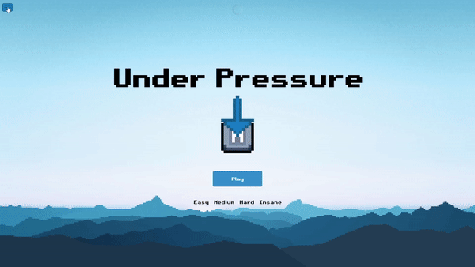
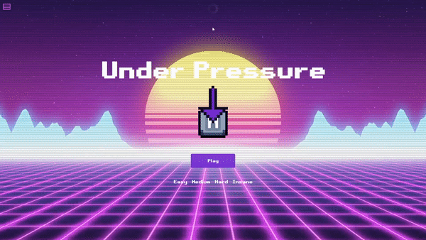

# Under Pressure

Under Pressure is a prompt-based game that consists in responding correctly to prompts in the least time possible.

Currently it works with prompts asking to type a key, word or phrase.

It counts with 4 different difficulties: Easy, Medium, Hard and Insane.


<h1>Features:</h1>

<ul>
    <li>Scoreboard</li>
    <li>Key, Word and Phrase Prompts</li>
    <li>Difficulty in 4 Levels</li>
    <li>GUI Themes</li>
    <li>MySQL Interaction via API</li>
    <li>User Creation via GitHub Authentication</li>
</ul>

-----

<h3>Profile via Github</h3>
</img>

-----

<h3>GUI Themes</h3>
</img>


<h1>Instructions</h1>

<ul><h3>Requirements:</h3> 
    <li>OAuth App</li>
    <li>MySQL Database</li>
</ul>


Create an OAuth app in (https://github.com/settings/developers) with a homepage url, Ex:(http://localhost:8000), and a authorization callback url, Ex:(http://localhost:8000/auth/oauth-callback).
Acess to a MySQL Database is needed to for full funcionality, providing it's credentials via .env as show in .env.example.

After setting up, you can start the project with: 

```bash
npm install
npm run dev
```
